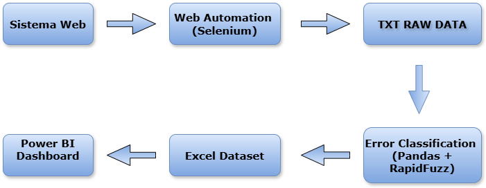
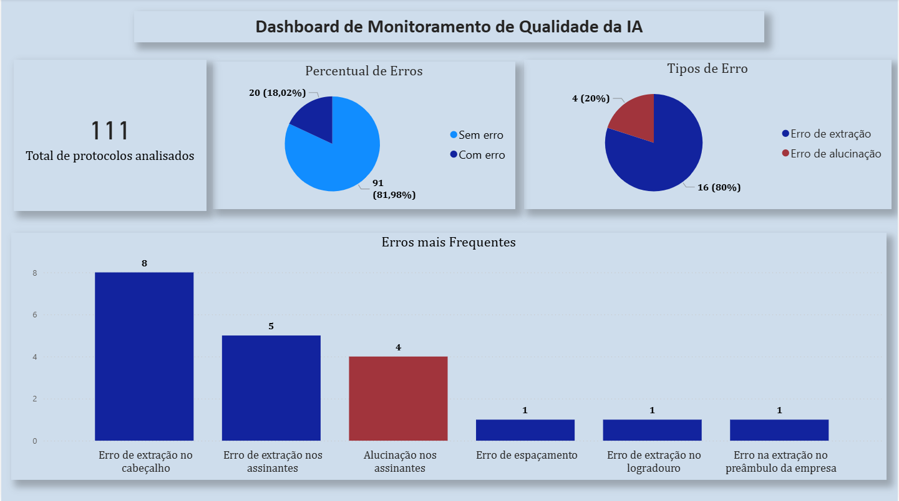

# AI Error Monitoring Pipeline

Pipeline de monitoramento e análise de erros de um sistema de IA responsável por extrair informações de documentos societários.

O projeto automatiza a coleta de motivos de rejeição, estrutura os dados de erro permitindo a criação de dashboards analíticos para acompanhar o desempenho do modelo.

---
# Visão Geral do Projeto

Este projeto foi desenvolvido para monitorar o desempenho de um sistema de IA responsável por extrair informações estruturadas de documentos societários enviados para um portal de registro empresarial.

Quando a IA falha na extração correta das informações, o documento é revisado por um humano que registra um **motivo de rejeição** explicando o erro encontrado.

Cada protocolo pode ter dois status principais:

- **Aprovado**
- **Rejeitado**

Exemplo de motivo de rejeição: IA não extraiu CNPJ do cabeçalho

O objetivo do projeto é:

- automatizar a coleta dos motivos de rejeição
- estruturar os dados de erro
- classificar os erros cometidos pela IA
- monitorar o desempenho do modelo ao longo do tempo
- identificar oportunidades de treinamento direcionado do modelo

O pipeline integra **automação web, processamento de dados e visualização em BI**.

---
# Arquitetura do Pipeline

O pipeline segue quatro etapas principais:

1. Coleta automática dos motivos de rejeição
2. Estruturação e limpeza dos dados extraídos
3. Classificação automática dos erros utilizando fuzzy matching e regras compostas
4. Monitoramento analítico via dashboard

---

# Dashboard de Monitoramento

Os dados estruturados alimentam um **dashboard analítico** desenvolvido para monitorar o desempenho do sistema de IA.

O dashboard apresenta:

## Métricas gerais

- total de protocolos analisados
- percentual de erros
- percentual de acertos

---

## Classificação de erros

Ranking dos erros mais frequentes cometidos pela IA.

Exemplos:

- erro de extração no cabeçalho
- alucinação nos assinantes
- erro de extração nos assinantes
- erro de extração no preâmbulo

---

## Contexto do Projeto

Este projeto surgiu a partir da identificação de uma limitação na forma como os erros de um sistema de IA eram monitorados.

Embora os documentos rejeitados possuíssem motivos de erro registrados, essas informações não estavam estruturadas de forma que permitisse análise sistemática ou acompanhamento da performance do modelo ao longo do tempo.

A partir dessa observação, foi desenvolvido um pipeline de coleta, estruturação e análise desses dados, permitindo transformar registros operacionais em métricas analíticas.

---

# Features 

- Automação da coleta de motivos de rejeição em portal web
- Extração estruturada de informações a partir de registros de erro
- Classificação automática de erros utilizando fuzzy matching (RapidFuzz)
- Suporte à identificação de **múltiplos erros em um mesmo protocolo**
- Sistema de **regras simples e regras compostas** para classificação
- Estruturação automática do dataset para análise
- Monitoramento visual da performance da IA
- Identificação de padrões de falha para orientar treinamento do modelo
- Pipeline completo: **coleta → processamento → análise**

---

# Automação Web

A coleta dos motivos de rejeição foi automatizada utilizando **Python e Selenium**.

O fluxo inicial é iniciado manualmente pelo usuário:
1. Login no portal
2. Acesso à área de documentos
3. Aplicação de filtros para protocolos rejeitados
4. Execução da consulta

A partir desse ponto, o script assume o controle da navegação.

Para cada protocolo listado, o script executa:
1. Abrir os detalhes do protocolo
2. Acessar a interface de rejeição
3. Ler o campo contendo o motivo de rejeição
4. Extrair o texto
5. Salvar o motivo
6. Retornar à lista de protocolos
7. Continuar para o próximo registro

---

# Desafios Técnicos
Durante o desenvolvimento da automação foram enfrentados desafios comuns em aplicações web modernas baseadas em frameworks frontend.

Principais problemas encontrados:

- `StaleElementReferenceException`
- `ElementClickInterceptedException`
- recriação do DOM após navegação
- carregamento assíncrono da tabela
- paginação dinâmica

Soluções implementadas:

- espera ativa para estabilização da tabela
- relocalização dos elementos após navegação
- funções robustas de clique
- identificação dos registros processados para evitar duplicação

---

# Saída Bruta da Automação

O script gera um arquivo texto contendo os motivos de rejeição extraídos.

Arquivo gerado: **motivos_rejeicao.txt**

Exemplo de estrutura:

RELATÓRIO – MOTIVOS DE REJEIÇÃO

Protocolo 0001

Erro de extração no cabeçalho

Protocolo 0002

Alucinação nos assinantes

---

# Processamento e Estruturação dos Dados

Após a coleta, o arquivo TXT é transformado em um dataset estruturado.

Utilizando **Pandas** e **RapidFuzz**, os motivos de rejeição são analisados e classificados automaticamente em categorias de erro.

O sistema utiliza dois tipos de regras de classificação:

### Regras simples

Detectam palavras-chave individuais associadas a determinados erros.

Exemplo:

- "cabeçalho"
- "bairro"
- "rg"
- "filial"

### Regras compostas

Detectam **combinações de palavras** que indicam um tipo específico de erro.

Exemplo:

- "entrada" + "sócio"
- "saída" + "sócio"
- "nome" + "empresa"

Esse mecanismo reduz falsos positivos e melhora a precisão da categorização.

### Detecção de múltiplos erros

Um mesmo protocolo pode apresentar **mais de um erro simultaneamente**.

Exemplo de motivo de rejeição:

IA não extraiu o sócio X e também não extraiu a saída da sócia Y.

Nesse caso, o sistema classifica o protocolo em **mais de uma categoria de erro**.

Para permitir análises mais precisas, o dataset é expandido de forma que **cada categoria de erro seja registrada como uma linha independente**, mantendo o mesmo número de protocolo.

Isso permite medir com mais precisão a frequência de cada tipo de falha da IA.

---

# Resultados Obtidos

A análise dos dados permitiu identificar falhas recorrentes e orientar treinamentos específicos do modelo de IA.

Após a implementação de treinamentos direcionados para determinados tipos de erro, foram observadas melhorias significativas na taxa de acerto do sistema.

Os principais foram: 

Aumento de 15 pontos percentuais na acurácia geral. 

Redução de 80% em erros de alucinação e 75% nos erros de extração. 

Diminuição da variabilidade de erros. 

A análise histórica demonstrou que **treinamentos direcionados com base na análise sistemática de erros podem reduzir significativamente falhas recorrentes, mesmo em IA’s altamente treinadas**.

---

# Estrutura do Projeto

ai-error-monitoring-pipeline

├── automation

│ └── collect_rejection_reasons.py

├── data processing

│ └── process_rejection_reasons.py

├── sample data

|  └── motivo_rejeicao_exemplo.xlsx

|  └── motivo_rejeicao_exemplo.txt

├── dashboard

│ └── dashboard_preview.png

├── images

│ └── architecture_diagram.png

├── requirements.txt

└── README.md

---

# Tecnologias Utilizadas

- Python
- Selenium
- Pandas
- RapidFuzz
- Power BI

---
# Como Executar o Projeto

1. Clone o repositório
git clone https://github.com/Mayradias/ai-error-monitoring-pipeline.git

2. Instale as dependências
pip install -r requirements.txt

3. Execute o script de automação
python automation/automation_collect_rejection_reasons.py

4. Execute o processamento dos dados
python data_processing/process_rejection_reasons.py

---
# Objetivo do Projeto

O objetivo deste projeto é criar um sistema de **monitoramento contínuo da qualidade de sistemas de IA**, permitindo:

- identificar rapidamente erros recorrentes
- orientar novos treinamentos do modelo
- medir o impacto de melhorias implementadas
- acompanhar a evolução da precisão da IA

---

# Observações

Todos os dados utilizados neste repositório foram **anonimizados ou simulados**, e nenhuma informação sensível ou proprietária foi incluída.
